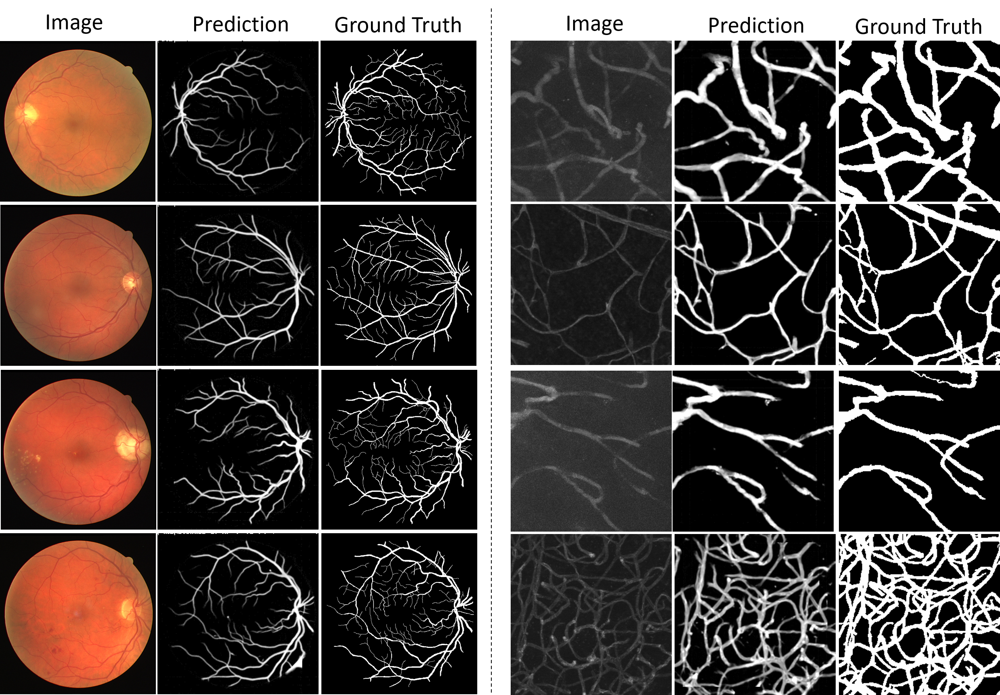

## TDBM

We present additional qualitative results on vessel extraction in XCA and zero-shot vessel segmentation to demonstrate the generalization ability of our method. The source code and trained model weights will be released after the completion of the review process.

### Vessel Extraction in XCA (Internal & External Dataset)

> The following results are from the **internal dataset** and are provided for demonstration purposes only.

|-----------Origianl XCA ---------|----------------DSA--------------|---------------Ours---------------|

https://github.com/user-attachments/assets/f90df143-a752-4c15-893c-36056dac6aad

---

https://github.com/user-attachments/assets/7092542d-0084-4f4d-b386-0267d9fab10b

---

> The following ceses are from **publicly available external datasets** ([🔗 XACV Dataset](https://kirito878.github.io/DeNVeR/)). 

<video src="src/E-01.mp4" width="600" controls autoplay muted loop></video>  
---

https://github.com/user-attachments/assets/75cec402-e903-4c5e-b08a-592f778337e4  

---

## Zero-shot Vessel Segmentation

Here are more results from zero-shot vessel segmentation:

**Data sources:**  
[🔗 DRIVE Dataset](https://ieeexplore.ieee.org/abstract/document/1282003/) | [🔗 VessMAP Dataset](https://journals.plos.org/plosone/article?id=10.1371/journal.pone.0322048)

